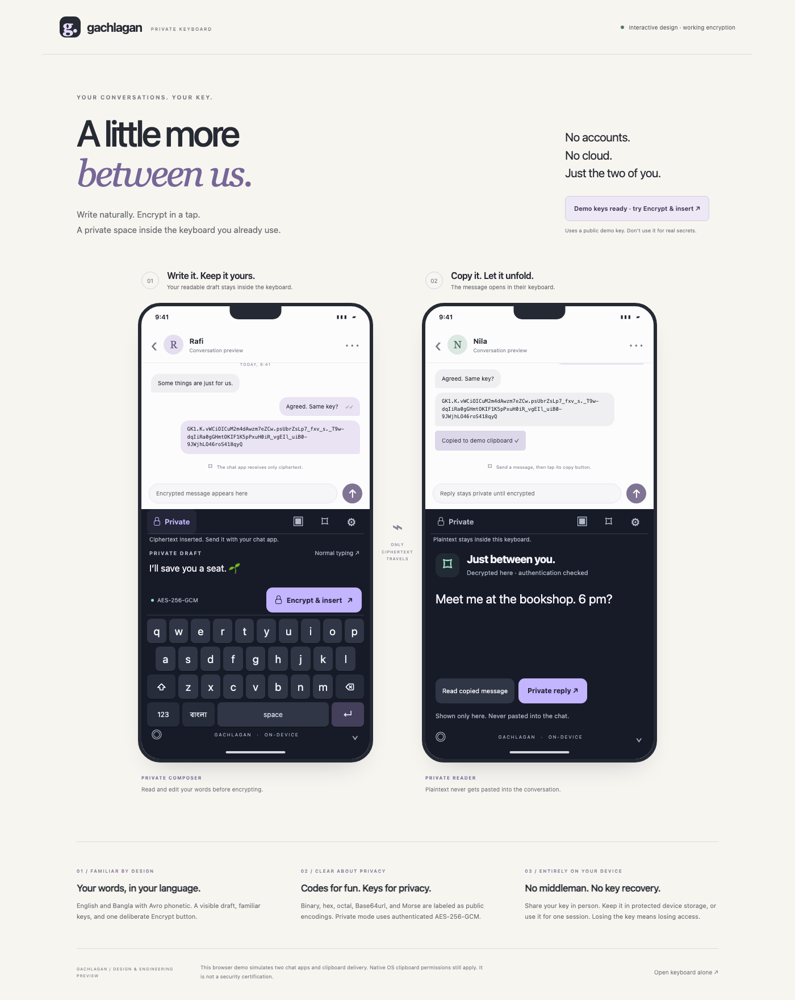

# Gachlagan private keyboard

An offline Android keyboard and iOS keyboard extension with a **visible private draft**, one-tap encryption, and an in-keyboard message reader. There are no accounts, encryption servers, analytics, or online key services.

**Release status:** Android debug and unsigned release builds are available; automated tests are described in [the work log](docs/PROGRESS.md). iOS device testing and independent security review remain outstanding. This is not yet a production-approved release. Read [the security model and limits](docs/SECURITY.md) before using it for sensitive messages.



## Try the design

Requirements: Node.js 20+.

```sh
npm ci
npm run preview
```

Open **http://127.0.0.1:4173**. The two-phone preview uses the actual keyboard UI and real local encryption. Click **Set up a demo conversation**, type in the visible draft, encrypt, send, and copy the received message. The recipient’s keyboard shows the plaintext; Private reply completes the return flow.

The demo uses a public test key and a simulated clipboard. It is for review, not real secrets. The localhost HTTP server only serves preview files; installed keyboards bundle these files and need no server.

## Everyday flow

1. Open keyboard settings on both phones. Enter the same generated key or long shared passphrase, exchanged in person. Save it in protected device storage if desired.
2. Type into the **Private draft**. The words are visible to you and remain inside the keyboard. Tap বাংলা for local Avro phonetic: `ami` → `আমি`, `bangladesh` → `বাংলাদেশ`.
3. Tap **Encrypt & insert**. Only the ciphertext enters the chat. Use the chat app’s Send button.
4. Copy a received GK1 message. Automatic reading is on by default: while the keyboard is visible and OS clipboard access is allowed, the message opens directly in the reader. A saved device key is loaded automatically; otherwise enter the shared key once. If your OS misses the copy event, tap the small **Read copied message** button in the toolbar. No paste into the chat is needed.
5. Tap **Private reply** to compose again. Lock clears the active key and plaintext. A saved key can unlock automatically on the next copied message; otherwise enter your key again.

Settings separate authenticated AES-256-GCM encryption from binary, hex, octal, Base64url, and Morse **encodings**. Encodings are public and need no key. Morse supports English letters/numbers/common punctuation and decodes in uppercase; use byte encodings for Bangla. Hashes cannot be decrypted and are not presented as messaging modes.

Normal typing sends text directly to the app and is explicitly labeled as unprotected. The private composer is necessary because encrypting plaintext after an app has already seen it cannot undo that exposure. The current Avro composition path is the private composer.

## Build Android

Requirements: Android SDK 36, Build Tools 36, JDK 21. Minimum Android 8 / API 26, with an up-to-date Android System WebView.

```sh
npm run build:secure
cd mobile/android
./gradlew assembleDebug assembleRelease lintDebug
```

Set `ANDROID_HOME` to your SDK or configure `mobile/android/local.properties`. On this development machine the SDK is `/opt/homebrew/share/android-commandlinetools`.

- Debug APK: `mobile/android/app/build/outputs/apk/debug/app-debug.apk`
- Unsigned release APK: `mobile/android/app/build/outputs/apk/release/app-release-unsigned.apk`

Install the debug APK, open Gachlagan Keyboard, enable it, and select it. Debug builds enable WebView inspection and include a test host; use test messages only. Release builds disable debugging and exclude that host. The release APK needs your signing configuration before distribution. INTERNET permission is removed from the merged manifest; backups and device transfer of app data are excluded.

## Build iOS

Requirements: full Xcode and an Apple development team. The existing project supports iOS 15.6+; real OS compatibility remains to be verified.

```sh
npm run build:secure
open mobile/ios/KMSample2.xcodeproj
```

The internal project name is inherited from the original starter; the product is Gachlagan Keyboard. Set your team for both targets and adjust bundle IDs/entitlements as necessary. Enable the keyboard in Settings → General → Keyboard → Keyboards. Full Access and paste permission may be required for clipboard reading. Neither permission creates a network dependency.

The active targets no longer link or embed the legacy Keyman engine, Sentry, Reachability, DeviceKit, or ZIPFoundation. Carthage/bootstrap-ios is only for the historical baseline and is not needed for this branch. The extension uses bundled Avro, WebKit, CryptoKit/CommonCrypto, and device-only Keychain storage.

## Verification

```sh
npm run verify          # Avro + crypto/encoding tests, legacy KMP build, UI sync
npm run test:interop    # Java / Apple CryptoKit / Web Crypto; requires JDK + Swift on macOS
npx playwright install chromium android
npm run test:e2e        # Browser conversation, privacy boundaries, accessibility
npm run test:android    # Running emulator + built debug APK; never runs on a physical phone
npm run capture:design # Preview server must be running
```

Android E2E installs the debug app and temporarily changes the emulator’s keyboard. It restores the previous keyboard afterward. It verifies native editor insertion, actual clipboard delivery, protected storage, deletion, and hide-to-lock. Neither this test host nor the browser preview proves compatibility with every messaging app.

## Source and history

- `secure/`: shared UI, privacy state, encodings, Web Crypto reference implementation.
- `mobile/android/`: Android IME, JCA encryption, Keystore, local WebView bridge.
- `mobile/ios/SWKeyboard/`: iOS extension, CryptoKit/CommonCrypto, Keychain, local WebView bridge.
- `design/`: interactive two-phone review page and screenshots.
- `third_party/jsAvroPhonetic/`: original MPL-1.1 Avro parser.
- `keyboard/`: original Keyman project retained for the baseline; its SDK is not part of the active private keyboard runtime.
- `docs/SECURITY.md`: protocol, threat model, sources, and release gates.
- `docs/PROGRESS.md`: verified results and unfinished work.

`main` preserves the first Avro milestone (`fca525a`). Encryption work is on `feature/offline-encrypted-keyboard`. See `git log --oneline --decorate --all`. Nothing has been pushed or published.
